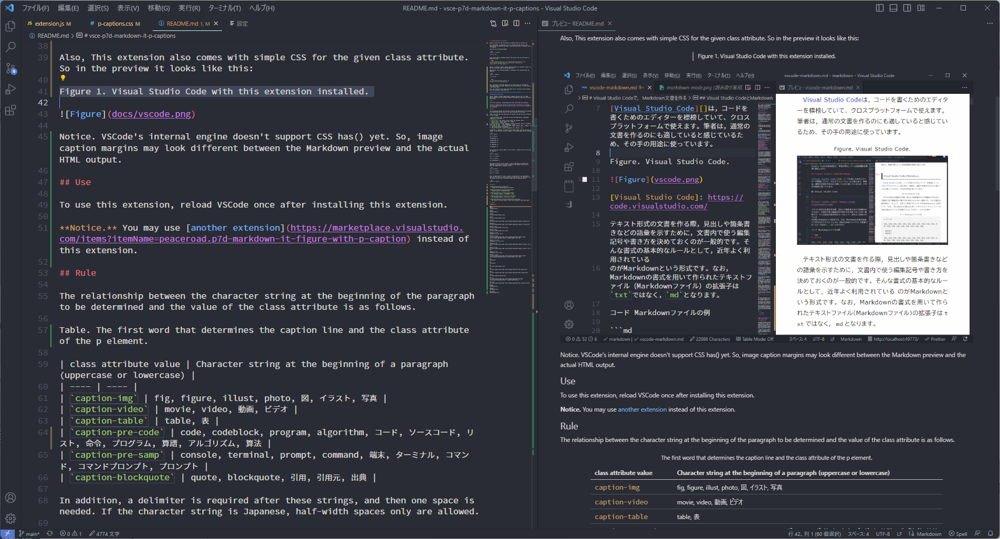

# vsce-p7d-markdown-it-p-captions

Warning. Version 0.5 may be different in usability than in the past use.

For a paragraph, it determines if it is a caption from the string at the beginning of the paragraph and adds a class attribute value to indicate that it is a caption.

You write the following Markdown.

```md
Figure 1. A caption.


```

In VS Code's built-in markdown preview, the value of the class attribute is added as follows.

```html
<p class="caption-img"><span class="caption-img-label">Figure 1<span class="caption-img-label-joint">.</span></span> A caption.</p>
<p></p>
```

However, by default, labels without sequence numbers are removed on output. So you can't see that label in the preview either.

Specifically, the following markdown is converted to the following HTML (by default):

```md
Figure. A caption.


```

```html
<p class="caption-img">A caption.</p>
<p></p>
```

Also, by default, full-width spaces used as label joints are converted to half-width spaces on output. Therefore, even on the preview, it can be seen as a half-width space.

Also, This extension also comes with simple CSS for the given class attribute. So in the preview it looks like this:

Figure 1. Visual Studio Code with this extension installed.



Notice. VSCode's markdown viewer doesn't support CSS has() yet. So, image caption margins may look different between the Markdown preview and the actual HTML output.

## Use

To use this extension, reload VSCode once after installing this extension.

**Notice.** You may use [another extension](https://marketplace.visualstudio.com/items?itemName=peaceroad.p7d-markdown-it-figure-with-p-caption) instead of this extension.

## Rule

The relationship between the character string at the beginning of the paragraph to be determined and the value of the class attribute is as follows.

Table. The first word that determines the caption line and the class attribute of the p element.

| class attribute value | Character string at the beginning of a paragraph (uppercase or lowercase) |
| ---- | ---- |
| `caption-img` | fig, figure, illust, photo, 図, イラスト, 写真 |
| `caption-video` | movie, video, 動画, ビデオ |
| `caption-table` | table, 表 |
| `caption-pre-code` | code, codeblock, program, algorithm, コード, ソースコード, リスト, 命令, プログラム, 算譜, アルゴリズム, 算法 |
| `caption-pre-samp` | console, terminal, prompt, command, 端末, ターミナル, コマンド, コマンドプロンプト, プロンプト |
| `caption-blockquote` | quote, blockquote, 引用, 引用元, 出典 |

In addition, a delimiter is required after these strings, and then one space is needed. If the character string is Japanese, half-width spaces only are allowed.

```md
Fig. A caption

Fig: A caption

図．キャプション

図。キャプション

図：キャプション

図　キャプション

図 キャプション
```

You can also put a serial number, such as 0-9A-Z.-, between the first term and the separator.

```md
Fig 1. A caption

Fig 1.1. A caption

Fig A: A caption

図1.1：キャプション
```

Only when it has this serial number, it can be identified by omitting the separator and adding only a space. In English, the caption written after a space must begin with an uppercase letter.

```md
Fig 1 A caption.

Fig 1.1 A caption.

Figure A A caption
```

Also, It identifies the `Figure.1` type. This format has a dot immediately after the first term, a serial number and a space after it. In this case, too, the caption written after a space must begin with an uppercase letter.

```md
Figure.1 A caption.
```

## Option

`p7dMarkdownItPCaptions.disableStyle`
:   Disable CSS of p7d-markdown-it-p-captions.

`p7dMarkdownItPCaptions.displayUnnumberedLabel`
:   Display caption's unnumbered label.

`p7dMarkdownItPCaptions.setDoubleQuoteFileName`
:   Set Filename: Caption. \"Filename\" A text.

`p7dMarkdownItPCaptions.setDoubleAsteriskFileName`
:   Set Filename: Caption. **Filename** A text.

`p7dMarkdownItPCaptions.notConvertLabelJointFullWidthSpace`
:   Not convert full-width space of label joint display to half-width space.

## Example

Firgure is a

```
Figure
<p>Figure</p>\n

Figure 
<p>Figure</p>\n

Figure.
<p class="caption-img"></p>\n

Figure:
<p class="caption-img"></p>\n

Figure 1
<p class="caption-img"><span class="caption-img-label">Figure 1</span></p>\n

Figure A.1
<p class="caption-img"><span class="caption-img-label">Figure A.1</span></p>

Figure. A cat.
<p class="caption-img">A cat.</p>\n

Figure: A cat.
<p class="caption-img">A cat.</p>\n

Figure is a cat.
<p>Figure is a cat.</p>\n

Figure 1. A cat.
<p class="caption-img"><span class="caption-img-label">Figure 1<span class="caption-img-label-joint">.</span></span> A cat.</p>

Figure 1 is a cat.
<p>Figure 1 is a cat.</p>\n

Figure A A cat.
<p class="caption-img"><span class="caption-img-label">Figure A</span> A cat.</p>\n

Figure 1 A cat.
<p class="caption-img"><span class="caption-img-label">Figure 1</span> A cat.</p>\n

Figure 1 a cat.
<p>Figure 1 a cat.</p>\n

Figure 1: A cat.
<p class="caption-img"><span class="caption-img-label">Figure 1<span class="caption-img-label-joint">:</span></span> A cat.</p>\n

図
<p>図</p>\n

図 
<p>図</p>\n

図.
<p class="caption-img"></p>\n

図1
<p class="caption-img"><span class="caption-img-label">図1</span></p>\n

図1.1
<p class="caption-img"><span class="caption-img-label">図1.1</span></p>\n

図 猫
<p class="caption-img">猫</p>\n

図1　猫
<p class="caption-img"><span class="caption-img-label">図1<span class="caption-img-label-joint"> </span></span>猫</p>\n

図1.1 猫
<p class="caption-img"><span class="caption-img-label">図1.1</span> 猫</p>\n

図は猫
<p>図は猫</p>\n

図1は猫
<p>図1は猫</p>\n

図1.1は猫
<p>図1.1は猫</p>\n
```
